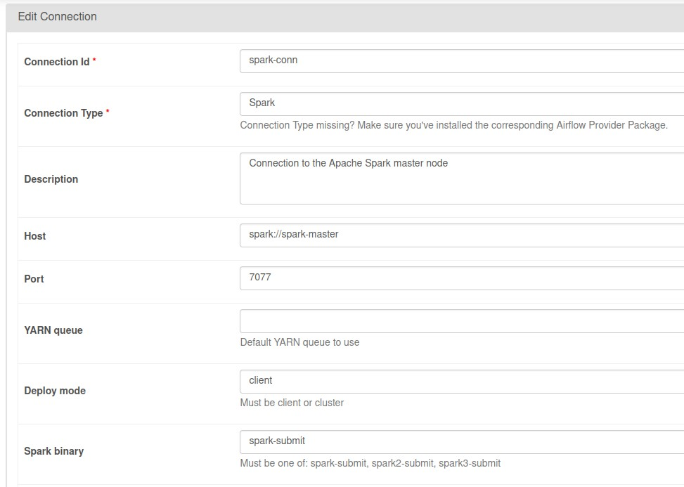
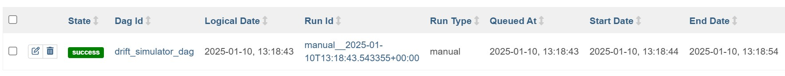
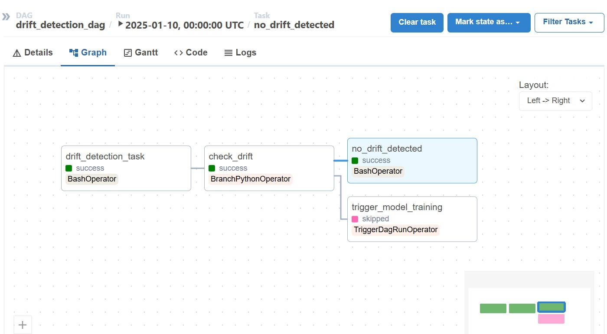
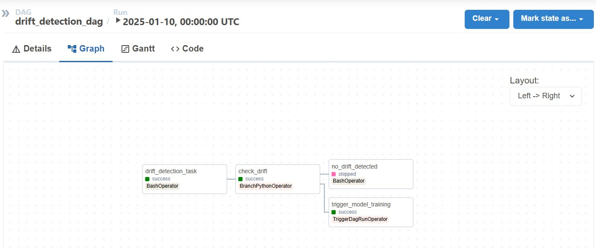
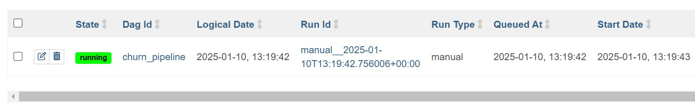
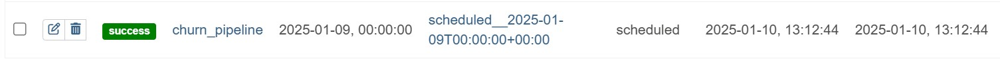

# Customer Churn Prediction Ops Pipeline

This is a machine learning pipeline to predict customer churn using Telco user data provided in the [Telco Customer Churn | Kaggle dataset](https://www.kaggle.com/datasets/blastchar/telco-customer-churn/code). The capabilities implemented in the pipeline are as follows:

- Perform data cleanup, such as handling NULL values, empty data, and so on.
- Simulate data drift.
- Monitor for data drift and automatically retrain the prediction model when drift occurs.

## Table of Contents

- [Requirements](#requirements)
- [Setup](#setup)
- [Running Locally](#running-locally)
- [Usage](#usage)
- [Contributing](#contributing)
- [License](#license)
- [Screenshots](#screenshots)

## Requirements

- Docker
- Git

## Setup

1. Clone the repository:
    ```bash
    git clone https://gitlab.informatika.org/xops-iga-gkub/customer-churn-prediction-ops-pipeline 
    
    cd customer-churn-prediction-ops-pipeline
    ```

2. Build and start the Docker containers:
    ```bash
    docker-compose up --build
    ```

3. Access the Airflow web interface at `http://localhost:8080` with the default credentials:
    - Username: `airflow`
    - Password: `airflow`

4. Setup Connection in Admin->Connections->[+] with the following configurations:


5. Trigger the available dags


## Usage

1. **Data Cleanup**: The `clean.py` script handles data cleanup tasks such as handling NULL values and empty data.
2. **Simulate Data Drift**: The `drift-simulator.py` script simulates data drift by generating biased data.
3. **Monitor Data Drift**: The `drift-detection.py` script monitors for data drift and triggers the model retraining pipeline if drift is detected.

## Screenshots
Drift Simulator


Drift undetected


Drift detected, with relearning


Relearning if drift detected


Scheduled model relearning
